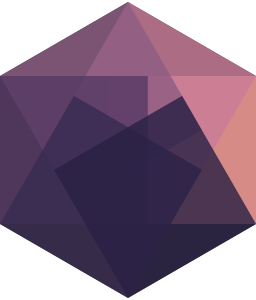

# Hypergraph designs 

The Hypergraph designs, centralized in this repository for ease of reuse and findability. Available under [CC0 Public Domain Dedication](./LICENSE).

## Wiki

* [Branding](https://github.com/hypergraph-xyz/design/wiki/Branding)
* [Colors](https://github.com/hypergraph-xyz/design/wiki/Colors)
* [Components](https://github.com/hypergraph-xyz/design/wiki/Components)
* [Icons and Assets](https://github.com/hypergraph-xyz/design/wiki/Icons-and-Assets)
* [Resources](https://github.com/hypergraph-xyz/design/wiki/Resources)
* [Typography](https://github.com/hypergraph-xyz/design/wiki/Typography)

## Contributors ✨

Thanks goes to these wonderful people ([emoji key](https://allcontributors.org/docs/en/emoji-key)):

<!-- ALL-CONTRIBUTORS-LIST:START - Do not remove or modify this section -->
<!-- prettier-ignore-start -->
<!-- markdownlint-disable -->
<table>
  <tr>
    <td align="center"><a href="https://chjh.nl"> <b>Chris Hartgerink</b></a> <a href="#design-chartgerink" title="Design">🎨</a></td>
    <td align="center"><a href="http://sobrakseaton.com"> <b>Patch Sobrak-Seaton</b></a> <a href="#design-psobrakseaton" title="Design">🎨</a></td>
  </tr>
</table>

<!-- markdownlint-enable -->
<!-- prettier-ignore-end -->
<!-- ALL-CONTRIBUTORS-LIST:END -->

This project follows the [all-contributors](https://github.com/all-contributors/all-contributors) specification. Contributions of any kind welcome!
