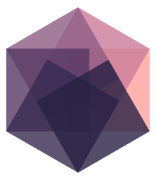

# Hypergraph designs 

The Hypergraph designs, centralized in this repository for ease of reuse and findability.

## Color scheme

The color scheme is inspired by [@aatishb](https://twitter.com/aatishb/status/1167546486005129216?s=20) and provides the various colors included in the logo. This is the primary color scheme across all Hypergraph instances, where relevant. This allows for consistency across the instances. Bonus: [it is pretty friendly for various types of color blindness](https://www.color-blindness.com/coblis-color-blindness-simulator/). 

| [Color name](http://chir.ag/projects/name-that-color/) | RGB | Hex |
| ----- | --- | --- |
| [Port Gore](http://chir.ag/projects/name-that-color/#282044) | 40, 32, 68 | #282044 |
| [Martinique](http://chir.ag/projects/name-that-color/#372A50) | 55, 42, 80 | #372a50 |
| [Voodoo](http://chir.ag/projects/name-that-color/#553864) | 85, 56, 100 | #553864 |
| [Strikemaster](http://chir.ag/projects/name-that-color/#8d5c83) | 141, 92, 131 | #8d5c83 |
| [Puce](http://chir.ag/projects/name-that-color/#ca7c98) | 202, 124, 152 | #ca7c98 |
| [Mona Lisa](http://chir.ag/projects/name-that-color/#ffa19b) | 255, 161, 155 | #ffa19b |
| [Chardonnay](http://chir.ag/projects/name-that-color/#ffbe89) | 255, 190, 137 | #ffbe89 |

## Contributors ✨

Thanks goes to these wonderful people ([emoji key](https://allcontributors.org/docs/en/emoji-key)):

<!-- ALL-CONTRIBUTORS-LIST:START - Do not remove or modify this section -->
<!-- prettier-ignore-start -->
<!-- markdownlint-disable -->
<table>
  <tr>
    <td align="center"><a href="https://chjh.nl"> <b>Chris Hartgerink</b></a> <a href="#design-chartgerink" title="Design">🎨</a></td>
    <td align="center"><a href="http://sobrakseaton.com"> <b>Patch Sobrak-Seaton</b></a> <a href="#design-psobrakseaton" title="Design">🎨</a></td>
  </tr>
</table>

<!-- markdownlint-enable -->
<!-- prettier-ignore-end -->
<!-- ALL-CONTRIBUTORS-LIST:END -->

This project follows the [all-contributors](https://github.com/all-contributors/all-contributors) specification. Contributions of any kind welcome!
