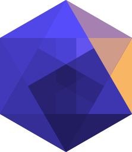

# Hypergraph designs 

The Hypergraph designs, centralized in this repository for ease of reuse and findability.

## Color scheme

The color scheme is inspired by [@aatishb](https://twitter.com/aatishb/status/1167546486005129216?s=20) and provides the various colors included in the logo. This is the primary color scheme across all Hypergraph instances, where relevant. This allows for consistency across the instances. Bonus: [it is pretty friendly for various types of color blindness](https://www.color-blindness.com/coblis-color-blindness-simulator/). 

| [Color name](http://chir.ag/projects/name-that-color/) | RGB | Hex |
| ----- | --- | --- |
| [Steel Gray](http://chir.ag/projects/name-that-color/#2A2440) | 42, 36, 64 | #2A2440 |
| [Martinique](http://chir.ag/projects/name-that-color/#362C4A) | 54, 44, 74 | #362C4A |
| [Voodoo](http://chir.ag/projects/name-that-color/#4E375A) | 78, 55, 90 | #4E375A |
| [Falcon](http://chir.ag/projects/name-that-color/#7B5473) | 123, 84, 115 | #7B5473 |
| [Turkish Rose](http://chir.ag/projects/name-that-color/#AC6D84) | 172, 109, 132 | #AC6D84 |
| [My Pink](http://chir.ag/projects/name-that-color/#D68B86) | 214, 139, 134 | #D68B86 |

## Contributors ✨

Thanks goes to these wonderful people ([emoji key](https://allcontributors.org/docs/en/emoji-key)):

<!-- ALL-CONTRIBUTORS-LIST:START - Do not remove or modify this section -->
<!-- prettier-ignore-start -->
<!-- markdownlint-disable -->
<table>
  <tr>
    <td align="center"><a href="https://chjh.nl"> <b>Chris Hartgerink</b></a> <a href="#design-chartgerink" title="Design">🎨</a></td>
    <td align="center"><a href="http://sobrakseaton.com"> <b>Patch Sobrak-Seaton</b></a> <a href="#design-psobrakseaton" title="Design">🎨</a></td>
  </tr>
</table>

<!-- markdownlint-enable -->
<!-- prettier-ignore-end -->
<!-- ALL-CONTRIBUTORS-LIST:END -->

This project follows the [all-contributors](https://github.com/all-contributors/all-contributors) specification. Contributions of any kind welcome!
